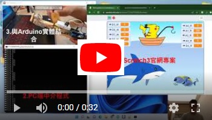
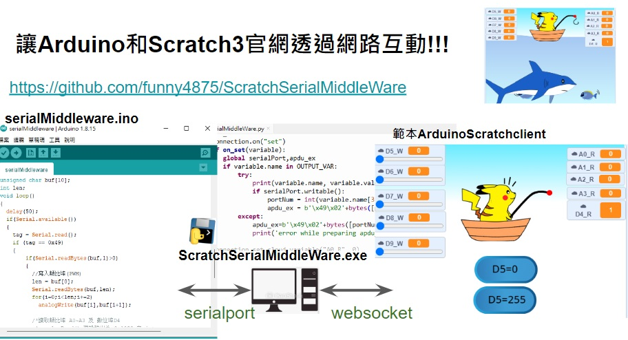

# ScratchSerialMiddleWare
A Middleware support Scratch3 communicate with Arduino by serial port
(https://youtu.be/ga8hU_jUzjw)

### 在python中 使用 scratchclient 和 scratch3官網做各種互動
本專案利用 「讀寫雲端變數」 之功能，將 Serial port 接收到的訊號傳遞給 scratch3之專案,  
藉此可和 Arduino、nodeMCU 等開發板做互動。  
目前提供 Arduino 之韌體互動規格如下：  
- Arduino端：  
  - 輸出：  
    - PWM 輸出埠 D5,D6,D9  (0-255)
    - 數位 輸出埠 D7,D8   (0 or 1)
  - 輸入：  
    - 類比埠 A0,A1,A2,A3 (0~255)  
    - 數位埠 D4 (0 or 1)  使用 INPUT_PULLUP(內接高壓與上拉電阻)  
  - 保留下列有特殊通訊埠並將他們預設為0，可充當GND使用  
    - A4: SDA  
    - A5: SCL  
    - D2 D3: interrupt 0,1  
    - D10~D13: SPI  
- PC 端：  
  中介程式參數說明如下：
  - ScratchSerialMiddleWare.exe <使用者名稱> <密碼> <scratch專案編號> <連接Arduino序列埠> <可讀入雲端變數列表>  
  ex:  
  ScratchSerialMiddleWare.exe ccsh_ky 123456987 724014896 COM6 A0_R,A1_R,D4_R  
  
- Scratch3 端雲端變數：  
  - 讀取 Arduino port 內容：
    - A0_R:讀取 A0 類比埠之電壓對應值 0-255
    - A1_R:讀取 A1 類比埠之電壓對應值 0-255
    - A2_R:讀取 A2 類比埠之電壓對應值 0-255
    - A3_R:讀取 A3 類比埠之電壓對應值 0-255
    - D4_R:讀取 D4 數位埠之電壓對應值 0 or 1
  - 寫入 Arduino port :
    - D5_W:寫入 D5 PWM 電壓對應值 0~255
    - D6_W:寫入 D6 PWM 電壓對應值 0~255
    - D9_W:寫入 D9 PWM 電壓對應值 0~255
    - D7_W:寫入 D7 數位 電壓對應值 0 or 1
    - D8_W:寫入 D8 數位 電壓對應值 0 or 1  

   
  Scratch3 範本：https://scratch.mit.edu/projects/724014896/ 
  
